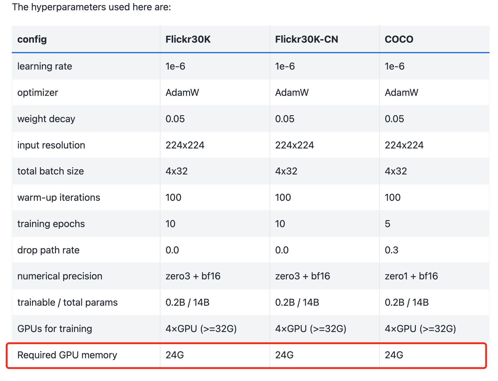


***Classic Questions***

**1. Is there any performance metrics for using InternVL2 for object detection (including single object detection capability)?**
- https://github.com/OpenGVLab/InternVL/issues/359
- Currently, the model can perform grounding tasks. For specific scores, please refer to the link [https://github.com/OpenGVLab/InternVL/tree/main/internvl_chat#-evaluation](https://github.com/OpenGVLab/InternVL/tree/main/internvl_chat#-evaluation%EF%BC%8C%E7%9C%8BVisual)[, see the Visual](https://github.com/OpenGVLab/InternVL/tree/main/internvl_chat#-evaluation%EF%BC%8C%E7%9C%8BVisual) Grounding section. For more common object detection and open world detection, InternVL series models are evaluated on grounding in RefCOCO as shown in the table below:

  


- We use the following prompt to evaluate InternVL's grounding ability: Please provide the bounding box coordinates of the region this sentence describes: `<ref>{}</ref>`

  
**2. Specific format for multi-round dialogue and video in custom dataset format**
- https://github.com/OpenGVLab/InternVL/issues/356
- You can prepare data according to this document: <https://internvl.readthedocs.io/en/latest/get_started/chat_data_format.html>

  Format for multiple images:
```python
{
  "id": 0,
  "image": ["path/to/image1.jpg", "path/to/image2.jpg", "path/to/image3.jpg"],
  "width_list": [111, 222, 333],
  "height_list": [111, 222, 333],
  "conversations": [
    {"from": "human", "value": "<image>\nuser input <image>\nuser input"},
    {"from": "gpt", "text": "assistant output"},
    {"from": "human", "value": "<image>\nuser input"},
    {"from": "gpt", "text": "assistant output"}
  ]
}
```

**3. LORA fine-tuning issue of InternVL2**
- https://github.com/OpenGVLab/InternVL/issues/350
- https://github.com/OpenGVLab/InternVL/issues/347
- You can try updating to the latest code and then fine-tune according to the following document:

  Fine-tuning InternVL 2.0: <https://internvl.readthedocs.io/en/latest/internvl2.0/finetune.html>
  Fine-tuning InternVL 1.5: <https://internvl.readthedocs.io/en/latest/internvl1.5/finetune.html>

**4. Excessive security hardening of the Engineering Center online demo**
- https://github.com/OpenGVLab/InternVL/issues/353
- It is due to excessive security hardening, and we will continue to optimize this issue soon.

**5. Resource configuration required for model inference, deployment, and fine-tuning**
- https://github.com/OpenGVLab/InternVL/issues/79
- https://github.com/OpenGVLab/InternVL/issues/281
- https://github.com/OpenGVLab/InternVL/issues/283
- https://github.com/OpenGVLab/InternVL/issues/293
- https://github.com/OpenGVLab/InternVL/issues/295
- You can align the package versions in the dependency environment here: <https://github.com/OpenGVLab/InternVL/blob/main/internvl_chat/pyproject.toml>. You can also try deploying this new local demo: <https://internvl.readthedocs.io/en/latest/get_started/local_chat_demo.html>. Start the model worker according to [https://github.com/OpenGVLab/InternVL/blob/main/document/how_to_deploy_a_local_demo.md#launch-a-model-worker](https://github.com/OpenGVLab/InternVL/blob/main/document/how_to_deploy_a_local_demo.md#launch-a-model-worker%E8%BF%99%E4%B8%AA%E6%89%A7%E8%A1%8C%E7%9A%84).
- InternVL-1-5 is a 26B model, with model parameters consuming about 50G of memory in BF16, considering the additional overhead during training, it should require 100-150G. During training, you can use DeepSpeed Zero to distribute these overheads across different GPUs.
- You can refer to this document to finetune InternVL-G. It lists the memory usage for different scenarios:

  <https://internvl.readthedocs.io/en/latest/internvl1.0/internvl_g.html> The GPU memory requirement is shown here:

  

**6. Abnormal generation results (including repetition, garbled text, etc.)**
- https://github.com/OpenGVLab/InternVL/issues/289
- This issue is due to an older version of transformers, please use transformers==4.37.2

**7. Context length of each model**
- https://github.com/OpenGVLab/InternVL/issues/272
- InternVL-Chat-V1-5 has a 4k context length. Mini-InternVL-Chat-2B/4B-V1-5 has an 8k context length. All models in the InternVL2 series have an 8k context length.

**8. Slow inference**
- https://github.com/OpenGVLab/InternVL/issues/250
- Using the 4-bit model quantized by AWQ is recommended, which is very fast and occupies less GPU memory than int8.<https://huggingface.co/OpenGVLab/InternVL-Chat-V1-5-AWQ>

```python
from lmdeploy import pipeline
from lmdeploy.messages import TurbomindEngineConfig
from lmdeploy.vl import load_image

model = 'OpenGVLab/InternVL-Chat-V1-5-AWQ'
image = load_image('https://raw.githubusercontent.com/open-mmlab/mmdeploy/main/tests/data/tiger.jpeg')
backend_config = TurbomindEngineConfig(model_format='awq')
pipe = pipeline(model, backend_config=backend_config, log_level='INFO')
response = pipe(('describe this image', image))
print(response)
```
- or service
```python
lmdeploy serve api_server OpenGVLab/InternVL-Chat-V1-5-AWQ --backend turbomind --model-format awq
```

**9. LMDeploy loading MiniInternVL error (due to lack of support for phi3)**
- https://github.com/OpenGVLab/InternVL/issues/230
- Only LMDeploy's pytorch engine supports phi3 models, please refer to our latest README for specific usage. You can follow this document to deploy the InternVL2-4B model using lmdeploy: https://internvl.readthedocs.io/en/latest/internvl2.0/deployment.html#launch-service

**10. How to deploy a local demo (streamlit version)**
- Please refer to https://internvl.readthedocs.io/en/latest/get_started/local_chat_demo.html#streamlit-demo